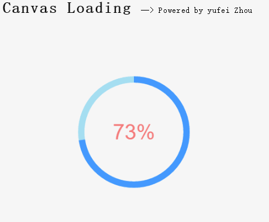
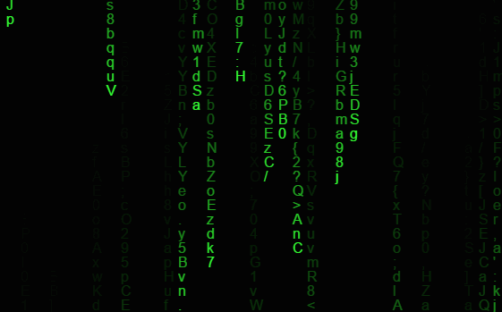

## 每周一点canvas动画——序

《每周一点canvas动画》是一个系列文章，本文并不对canvas的API做过多的介绍，我默认你已经了解基本的canvas绘图API，并在此告诉你如何使用简单的数学与物理知识创建相当酷炫的动画。一说到物理和数学知识各位骚年们是不是感觉蛋疼(原谅我说脏话了)，不过我要告诉你，我们用到的数学和物理知识真的很简单，一点都不可怕。

#### 1.支持情况
canvas作为H5中最为重要的新增特性，使开发者可以用它来创作各种令人惊叹的作品。但开发者最关心的问题肯定是浏览器的支持情况（图片来自张鑫旭博客）！


#### 2.本文主要内容
本系列文章主要介绍Canvas 2D动画原理，以及简单的如何在2D平面模仿3D效果的方法，中间可能会穿插一些与其他技术相结合的DEMO和项目。首先，我们创作动画的基本文档结构如下。
```bash
<!DOCTYPE html>
<html lang="en">
<head>
    <meta charset="UTF-8">
    <title>canvas动画序</title>
</head>
<body>
   <canvas id="canvas" width='500' height="500">
       <P>you browser not support canvas!</P>
   </canvas>
   <script>
       window.onload = function(){
       //我们的代码
       }
   </script>
</body>
</html>

```
在此我们需要明白动画的基本概念：
**动画其实是由不同的静态画面组成，每一幅静态画面我们叫做一帧（frame），当众多的静态画面按照一定的规则快速运动时，我们的眼睛就会欺骗我们的大脑，从而形成物体运动的假象。**在这里先给大家展示用Canvas创作的两个酷炫动画，看看它是否够简洁，够酷炫！

####1、百分比加载
第一个动画是一个用Canvas做的百分比加载动画（根据读者的建议，已经对错误的代码做了修改）。[codePen地址](http://codepen.io/supperjet/pen/MbbPeJ)



```bash
var canvas = document.getElementById('canvas'),  //获取canvas元素
    context = canvas.getContext('2d'),           //获取画图环境，指明为2d
    centerX = canvas.width/2,   				 //Canvas中心点x轴坐标
    centerY = canvas.height/2,  				 //Canvas中心点y轴坐标
    rad = Math.PI*2/100, 						//将360度分成100份，那么每一份就是rad度
    speed = 0.1; 								 //加载的快慢就靠它了
             
    //绘制蓝色外圈
    function blueCircle(n){
        context.save();
        context.beginPath();
        context.strokeStyle = "#49f";
        context.lineWidth = 12;
        context.arc(centerX, centerY, 100 , -Math.PI/2, -Math.PI/2 + n*rad, false);
        context.stroke();
        context.restore();
    }
         
    //绘制淡蓝色外圈
    function whiteCircle(){
        context.save();
        context.beginPath();
        context.strokeStyle = "#A5DEF1";
        context.lineWidth = 12;
        context.arc(centerX, centerY, 100 , 0, Math.PI*2, false);
        context.stroke();
        context.closePath();
        context.restore();
    }
         
    //百分比文字绘制
    function text(n){
        context.save();
        context.fillStyle = "#F47C7C";
        context.font = "40px Arial";
        context.textAlign = "center";
        context.textBaseline = "middle";
        context.fillText(n.toFixed(0)+"%", centerX, centerY);
        context.restore();
   }
         
    //动画循环
    (function drawFrame(){
         window.requestAnimationFrame(drawFrame, canvas);
         context.clearRect(0, 0, canvas.width, canvas.height);
             
         whiteCircle();
         text(speed);
         blueCircle(speed);
                
         if(speed > 100) speed = 0;
         speed += 0.1;
    }());
 </script>
</body>
</html>
```
在上面的代码段中，我们通过一个立即执行函数来执行我们的动画循环，并在内部通过
```bash
window.requestAnimationFrame(drawFrame, canvas);
```
循环调用自身，requestAnimationFrame是一个新的API,作用与setTimeInterval一样，不同的是它会根据浏览器的刷新频率自动调整动画的时间间隔。在循环中我们每次执行都会重新绘制蓝色的圆弧，和白色的圆环和百分比加载的文字，由于每次绘制的时间间隔很小，只有十几毫秒（主要看电脑），所以我们的肉眼是无法清楚地分别每一帧的画面，这样就形成了我们看到的动画。该API的兼容处理如下：

```bash
if(!window.requestAnimationFrame){
    window.requestAnimationFrame =(window.webkitRequestAnimationFrame||
                                   window.mozRequestAnimationFrame||
                                   window.oRequestAnimationFrame||
                                   window.msRequestAnimationFrame||
                                   function(callback){
                                       return window.setTimeout(callback,1000/60); 
                                 });
    
}

```

####2、黑客帝国(Matrix.js)
经典的黑客帝国效果，Geek们的最爱。目前，已经被我封装成插件，可供大家方便使用。[codePen地址](http://codepen.io/supperjet/pen/JbqZPK) | [插件地址](https://github.com/supperjet/Martrix.js)



具体代码：
```bash
var canvas = document.querySelector('canvas'),
    context = canvas.getContext('2d'),
    w = canvas.width = window.innerWidth,
    h = canvas.height = window.innerHeight;
           
 	//初始化
    var clearColor = 'rgba(0, 0, 0, .1)', 			//用于绘制渐变阴影
        wordColor = "#33ff33",			 			//文字颜色
        words = "0123456789qwertyuiopasdfghjklzxcvbnm,./;'\[]QWERTYUIOP{}ASDFGHJHJKL:ZXCVBBNM<>?",
        wordsArr = words.split(''), 				//将文字拆分进一个数组
        font_size = 16,  //字体大小
        clumns = w / font_size, 					//文字降落的列数
        drops = [];

     for(var i=0; i<clumns; i++){
         drops[i] = 1;
     }

   function draw(){
       context.save();
       context.fillStyle = wordColor;
       context.font = font_size + "px arial";
       //核心
       for (var i = 0; i < drops.length; i++){
			var text = wordsArr[Math.floor(Math.random() * wordsArr.length)];
				context.fillText(text, i * font_size, drops[i] * font_size);
				if (drops[i] * font_size > h && Math.random() > 0.98){
                        drops[i] = 0;
                }
					drops[i]++;
		}
       context.restore();
  }
           
	//动画循环
  (function drawFrame(){
        window.requestAnimationFrame(drawFrame, canvas);
        context.fillStyle = clearColor;
        context.fillRect(0, 0, w, h);  //注意这
        draw();
   }())
```
这段代码有两个比较核心的地方：
**1，在初始化部分，我们定义了一个变量clearColor = 'rgba(0, 0, 0, .1)',用于绘制阴影。其原理是：每当动画绘制新的一帧，就在上面覆盖一个透明度为0.1的黑色矩形。随着层数的叠加，文字就会被逐渐遮盖形成了我们看到的阴影。**

2，在初始化的注释处和核心模块处。首先，设置了每个字体的大小(font_size)。然后，用canvas的宽度除以字体的大小，就得到了需要绘制的列数(clumns)， 然后创建了一个数组drops,数组的长度为clumns,并且每个元素的值都为1(drops在这有什么用呢？继续往下看)。在绘制部分，我们采取的思路是一行一行的绘制，首先在循环中随机的获取文字，在文字绘制API部分注意这行代码：
```bash
context.fillText(text, i * font_size, drops[i] * font_size);
```
我们知道该API有三个参数，第一个是绘制的文字，第二，三是文字的坐标。在X坐标部分为`i * font_size`，也就是说在循环完成后每个文字的X轴坐标是(0, 16, 32,48...), 而Y坐标为`drops[i] * font_size`由于drops内元素的初始值都为1，所以文字的Y坐标为(16, 16, 16, ...),这样我们就相当于先绘制了第一行的文字。那么紧接着我们绘制第二行只需要将drops中的元素加1即可，即(第二行的Y轴坐标为（32，32，32...）。
依次类推，我们就绘制了满屏的文字，通过渐变阴影我们就可以看到文字似乎是向下运动的效果。为了让他们看上去运动的速度不一致，加上了这行代码：
```bash
if (drops[i] * font_size > h && Math.random() > 0.98){
           drops[i] = 0;
 }

```
这行代码判断的是当前绘制的这行文字的Y坐标是否超过了canvas的高度，如果超过又从第一行开始绘制，那么如何让他们出现差异性呢！小秘密在`Math.random() > 0.98`这，if中的两个条件一个是判断文字高度，另一个是判断一个随机数是佛大于0.98，只有当两个条件同时成立才能回到第一行重新绘制。所以，由于第二个条件是随机的，那么差异性就自然而然的出现了！

看看，只需要这么简单的代码就能写出这么酷炫的效果，是不是很赞！你也试试吧！不理解没关系，这里只是让你看看canvas能做出多么酷炫的效果。

下一节，我们就正式开始我们的Canvas动画之旅！！！