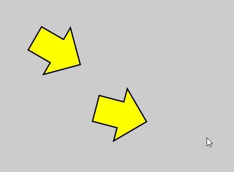

###《每周一点canvas动画》——三角函数

> [每周一点canvas动画代码文件](https://github.com/supperjet/H5-Animation)

本节主要内容有：
- 三角函数介绍
- 常用三角函数解析
- 跟随鼠标角度旋转

看到三角函数，勾股定理这样的数学名词是不是有种双腿打颤的感觉啊！好吧，就算你已经吓尿了，也不能否认我们中学学习的知识终于有了用武之地，挽起袖子，开整！！！

#### 1、三角函数
什么是三角函数呢？简单的定义：**所谓三角函数，在几何上来说就是夹角与边的关系**！为了更直观的表示，也为了让忘记的同学回忆起来，这里我给个示意图。


在上图中例出了几个常用的三角函数，角度与边（x, y和R）之间的关系如公式所示！那么在canvas中角度与边之间的关系是怎样的呢？首先，我们需要知道的是canvas中坐标是如何定义的。


如图所示，与普通坐标不同，canvas坐标以整个画布的左上角作为坐标原点，y轴朝下为正，x轴水平向右。坐标不同，对应的角度表示就有所差异，这个差异主要体现在角度的正负上。


上图中canvas的坐标与普通坐标感觉一样，但我想表达的是在canvas中顺时针方向为正，逆时针为负。

####2、常用三角函数
前面我们简单的介绍了三角函数的表示方法以及canvas的坐标系统。但是，在实际开发中我们不仅想要通过角度来推出两边的距离长度比值。而更关心的是**如何通过已知的距离(因为坐标的位置很好确定)来推出角度**。这里我们要用到**反三角函数**
```bash
sin(θ)=x/R   --->  θ = arcsin(x/R)
cos(θ)=y/R   --->  θ = arccos(y/R)
tan(θ)=x/y   --->  θ = arctan(x/y)
```
对应到javascript中,相应表示方法如下。
```bash
sin(θ)  --->  Math.sin( θ * Math.PI/180 )
cos(θ)  --->  Math.cos( θ * Math.PI/180 )
tan(θ)  --->  Math.tan( θ * Math.PI/180 )

θ = arcsin(x/R) ---> Math.asin(x/R)*(180/Math.PI)
θ = arccos(y/R) ---> Math.acos(y/R)*(180/Math.PI)
θ = arctan(x/y) ---> Math.atan(x/y)*(180/Math.PI)
```
好吧！看到这里也许你已经恶心得想吐了。但是，没办法这就是数学的魅力！这里需要强调的是：**canvas中角度的表示采用的是弧度制**。这样你就可以理解 `θ * Math.PI/180`是将角度转成弧度，比如：`30° = 30 * π /180 = π / 6`。 而将弧度转成角度自然就要用`弧度值``Math.asin(x/R)` 乘上`180/Math.PI`。这之间的转换关系，慢慢想想就明白了！

#### 3、Math.atan2(dy, dx)
相比于`Math.asin(`)和`Math.cos()`这两个函数，`Math.atan()`在开发中用到的更多。它可以直接通过两个直角边得到对应的角度值。相比于其他两个需要通过计算长边来得到角度值来说，计算过程更加简单！但是，该函数在角度的判定上回出现一个问题——**存在两个相同的角度值而无法判定物体具体的旋转角度**。详细说明如下图所示。


因为，tan函数的周期是（-π/2, π/2）,由于这一特性导致电脑是无法判断旋转的到底是哪个角度！！！这时，另一个函数就横空出世了，当当当当，他就是`Math.atan2(dy, dx)`!他不仅解决了上面我们说的问题，而且只需要传入横纵坐标距离就可以计算出对应的角度值！是不是很酷。

#### 4、跟随鼠标旋转

本章的理论知识已经介绍完成。现在，开始我们的第一个demo——`rotate-to-mouse.html`顾名思义就是跟随鼠标旋转。首先创建一个文件`arrow.js`，这个文件是使用canvas画一个箭头，并且为了今后方便使用，将它写成一个类文件！代码如下：
```bash
arrow.js文件

    function Arrow() {
        this.x = 0;  //初始位置
        this.y = 0;
        this.rotation = 0;  //初始旋转角度
        this.color = '#ffff00';

    }
    //在原型上定义draw方法
    Arrow.prototype.draw = function(context){
        context.save();
        context.translate(this.x , this.y); //将坐标移到this.x 和 this.y
        context.rotate(this.rotation); //设置旋转角度
        context.lineWidth = 5;  //设置线宽
        context.fillStyle = this.color; //设置填充色
        context.beginPath();  //路径开始
        context.moveTo(-50,-25);
        context.lineTo(0,-25);
        context.lineTo(0,-50);
        context.lineTo(50,0);
        context.lineTo(0,50);
        context.lineTo(0,25);
        context.lineTo(-50,25);
        context.closePath(); //路径闭合
        context.stroke(); //描边
        context.fill(); //填充
        context.restore();
    }
```
现在我们在`rotate-to-mouse.html`文件中引入它，来创建一个箭头
```bash
rotate-to-mouse.html 文件

  <canvas id='canvas' width="500" height="500" style="background:#ccc;">
      you browser not support canvas
  </canvas>

  <script src="../js/utils.js"></script> //引入我们的工具函数文件
  <script src="../js/arrow.js"></script> //引入我们的箭头函数文件
  <script>
      window.onload = function(){
        var canvas = document.getElementById('canvas');
        var context = canvas.getContext('2d');
        var centerX = canvas.width/2;
        var centerY = canvas.height/2;
        
        //传入canvas,获取鼠标在canvas上移动是的坐标
        var mouse = utils.captureMouse(canvas);
             
        //新建一个arrow对象
        var arrow = new Arrow();
             
        //将arrow的坐标设置为canvas的中心
        arrow.x = centerX;
        arrow.y = centerY;
                 
	  //动画循环函数
      (function drawFrame(){
          window.requestAnimationFrame(drawFrame,canvas);
          context.clearRect(0, 0, canvas.width, canvas.height);
				  
          //获取dy,dx值
          var dx = mouse.x - arrow.x,
          dy = mouse.y - arrow.y;
                      
          //设置旋转角度
      	  arrow.rotation = Math.atan2(dy, dx);
                    
         //调用draw方法画出
      	 arrow.draw(context);

      })();
}

</script>
```
我们最终得到的结果就是一个，可以跟随鼠标旋转的箭头。




####总结
这节你应该学会了如何运用三角函数，控制物体的旋转。重点公式：
```bash
dx = mouse.x - object.x;
dy = mouse.y - object.y;
object.rotation = Math.atan2(dy,dx);

```
