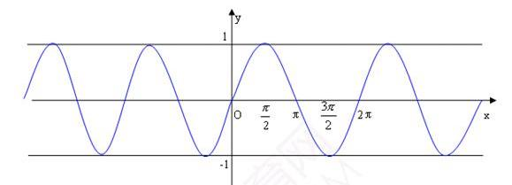
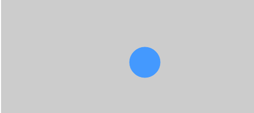
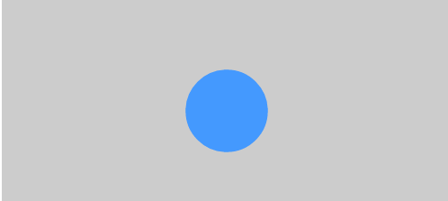

##《每周一点canvas动画》——波形运动

> [每周一点canvas动画代码文件](https://github.com/supperjet/H5-Animation)

在上一节我们介绍了canvas动画中有关三角函数的内容，以及一个跟随鼠标旋转的箭头动画。这一节主要介绍三角函数的波形运动。包括：
1. 平滑运动
2. 线性运动
3. 脉冲运动

### 1.Sin函数的波形

sin函数的波形想必骚年们不会感到陌生，其图形如下所示：



如果想要取得`sin`函数在[0, 2π]之间的值，非连续的情况下，可以这样估算。
```bash
    for(var angle=0; angle<Math.PI*2; angle+=0.1){
        console.log(Math.sin(angle)); //打印出角度对应的sin值
    }
```

### 1.平滑运动
首先介绍`Math.sin(angle)`的第一个应用——**平滑运动**。

平滑是指物体一种流畅的运动状态，与之相反的是机械式的简单的从0到1再到-1和0的这么一种状态。平滑的运动更加趋近与自然的运动状态，类似水草在水流中的左右摇摆，在摆动的过程中是有速度的变化的。

我们用`Math.sin`函数模仿的第一个运动，就是这种类似水草摆动的运动。另外，因为`sin`函数的值介于[-1,1]之间。所以在实际代码中需要乘以一个较大的值(也就是振幅，你懂得)，使其的摆动看起来明显一些。水草摆动的如下图所示,[在线演示地址](http://codepen.io/supperjet/pen/qRgKMZ)。


具体代码如下

```bash
//水草类
function Aqu(color, num, amp){
      this.startPoint = [];
      this.endPointX = [];
      this.endPointY = [];
      this.amp = [];
      this.beta = 0;
      this.color = (color == undefined)?"#3b154e":color;
      this.num = (num == undefined)?80:num;
}
       
 Aqu.prototype.init = function(){
       for(var i=0; i<this.num; i++){
           this.startPoint[i] = Math.random()*20 + i*10;
           this.endPointX[i] = this.startPoint[i];
           this.endPointY[i] = canvas.height/1.5 - Math.random()*50;
           this.amp[i] = Math.random()*10 + 40;
       }
   }

Aqu.prototype.draw = function(ctx){
       ctx.save();
       ctx.lineWidth = 14;
	   ctx.lineCap = "round";
       ctx.globalAlpha = 0.8;
	   ctx.strokeStyle =this.color;
       
       //Math.sin的应用
       this.beta += del*0.0012;
       var l = Math.sin(this.beta);
       
       for(var i=0; i<this.num; i++){
		  ctx.beginPath();
		  ctx.moveTo(this.startPoint[i], canvas.height);
          
          //周期性改变水草的顶点X坐标
          this.endPointX[i] = this.startPoint[i] + l*this.amp[i]
          
		  ctx.quadraticCurveTo(this.startPoint[i],canvas.height-120,this.endPointX[i],this.endPointY[i]);
		  ctx.stroke();
      }
       ctx.restore();
   }
   
var canvas = document.getElementById('canvas'),
    ctx = canvas.getContext('2d');
    canvas.height = 400;
    canvas.width = 800;
    
    //实例水草
    var oAqu = new Aqu();
    //初始化
    oAqu.init();
       
var oldTime = new Date().getTime(),
    del = null, newTime = null;
       
   (function drawFrmae(){
       window.requestAnimationFrame(drawFrmae);
       ctx.clearRect(0, 0, canvas.width, canvas.height);
           
       newTime = new Date().getTime();
       del = new Date().getTime() - oldTime;
       oldTime = newTime;
       
       oAqu.draw(ctx);
       }())
```
相比于机械的加减是不是更加的流畅呢？当然，你也通过改变Math.sin(this.beta)中的递增角度值，控制摆动的速度。

### 2.线性运动
线性运动是最简单的一种运动，物体匀速朝某个方向运动，就是线性运动。



原理很简单，具体代码请查看`linear-vertical-motion.html`

```bash
   <script>
       window.onload = function(){
           var canvas = document.getElementById('canvas'),
      		   context = canvas.getContext('2d');
               
           var angle = 0,
               range = 50,
               xspeed = 1,
               yspeed = 0.05;

           var ball = new Ball();
           
           (function drawFrame(){
               window.requestAnimationFrame(drawFrame,canvas);
               context.clearRect(0,0,canvas.width,canvas.height);

               ball.x += xspeed; //水平，沿x轴方向水平运动
               
               if(ball.x > canvas.width + ball.radius){
                   ball.x = -ball.radius;
               }
               //垂直， 由于angle角度没发生变化，所以纵坐标保持不变
               ball.y = canvas.height/2+Math.sin(angle)*range;
               
              // angle += 0.05; //取消注释看看发生了什么？
               ball.draw(context);
           })();
       }
    </script>
```
其实，这里如果你把`angle += 0.05`的注释取消，你会发现球的运动轨迹就与sin函数的图像一致了。

### 3.脉冲运动
除了作用于物体的速度，sin函数仍然可以作用于物体的大小变化。脉冲运动便是将sin函数运用于物体大小的变化中。



具体代码如下，详细代码请查看`plusing-motion.html`

```bash
window.onload = function(){
            var canvas = document.getElementById('canvas');
            var context  = canvas.getContext('2d');

            var angle = 0,
                range = 0.5,
                speed = 0.05,
                centerScale = 1;

            var ball = new Ball();
            	ball.x = canvas.width/2;
           	    ball.y = canvas.height/2;

            (function drawFrame(){
                window.requestAnimationFrame(drawFrame,canvas);
                context.clearRect(0,0,canvas.width,canvas.height);
                
                //sin值的变化，导致 ball.scaleX ， ball.scaleY属性变化
                ball.scaleX = ball.scaleY = centerScale + Math.sin(angle)*range;
                angle += speed;

                ball.draw(context);
            })();
        }
```
由此你应该知道，除了位置属性，我们还可以将sin函数与其他的属性相结合，来形成不同的运动形式。