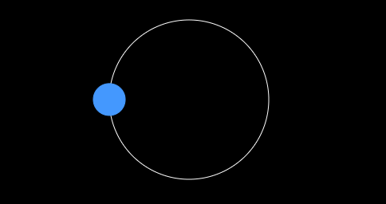
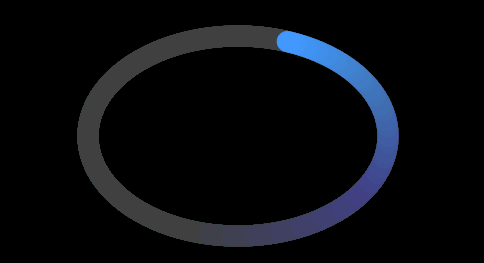

###《每周一点canvas动画》——圆周运动

> [每周一点canvas动画代码文件](https://github.com/supperjet/H5-Animation)

圆周运动可以分为两种基本的形式：`正圆运动`和`椭圆运动`。
在讲解圆周运动之前，必不可少的数学公式即将袭来。so,各位骚年们，请护好自己的膝盖。听不懂没关系，只要明白其中的原理就行。当然，能懂是最好的，这对后面学习高级动画是很有帮助的。好吧，废话少说直接上菜。

### 1.正圆运动
一般情况下，圆的直角坐标方程可以表示为：`x2+y2=R2`，根据此公式可以得出圆在直角坐标中的轨迹。也许，你会说这样就可以通过改变x,y的坐标位置让物体做圆周运动。但是，实际情况是这种方法并不可行。因为，你无法精确的计算出物体做圆周运动的每一个坐标位置。就算你成功计算出物体做圆周运动的精确坐标。OK!你可以想象那是多么大的工作量。所以，我们需要转变思路，让计算机去做这种精确的计算问题。


上图展示了从圆的函数表达式到圆的参数方程之间的转换过程。理解不理解都没有关系，总之你要明白，最终我们将 x, y 与 sin 和 cos 扯上关系了。而圆的参数方程就表示的是一个圆。这样我们想要让一个物体做圆周运动，就只需要让计算机自己去来计算每一帧物体所对应的坐标值。而我们所需要做的只是简单的改变`θ`值。有多简单呢，因为根据sin，cos函数的周期性只需要每一帧自增一个值或自减一个值。具体代码如下：
```bash
    window.onload = function(){
               var canvas = document.getElementById('canvas'),
                   context = canvas.getContext('2d');

               var ball = new Ball();

               var angle = 0, // 旋转的角度
                   centerX = canvas.width/2,
                   centerY = canvas.height/2,
                   radius = 100, // 定义半径
                   speed = 0.05; // 每帧旋转角度的增加值

               (function drawFrame(){
                   window.requestAnimationFrame(drawFrame, canvas);
                   context.clearRect(0,0,canvas.width, canvas.height);

                   //centerX, centerY 的作用是让球绕画布中心旋转
                   ball.x = centerX + Math.sin(angle)*radius;
                   ball.y = centerY + Math.cos(angle)*radius;

				   //角度增加
                   angle += speed;
                   ball.draw(context);
               }());
           }
```
效果图



ok,自己动手试试吧！看看是不是球体绕着画布中心做着圆周运动呢！这里我们需要的条件比较多 angle 和 Radius，在后面的章节中我们将介绍如何只通过 angle 就实现圆周运动。为了更容易理解，我劝你最好复习一下中学的知识，哈哈！！！

### 2.椭圆运动
椭圆和正圆的不同之处可以这样理解：**正圆半径在x轴和y轴上的距离是相同的，都是Radius.而椭圆则是不同的,我们用a, b 表示。**


具体到代码里，就是半径不同了呗！是不是so easy,上代码：
```bash
window.onload = function(){
            var canvas = document.getElementById('canvas');
            var context = canvas.getContext('2d');
            var ball = new Ball();
            
            var centerX = canvas.width/2,
                centerY = canvas.height/2,
                angle = 0,
                radiusX = 50,
                radiusY = 100,
                speed = 0.05;
            
            	ball.x = centerX;
            	ball.y = centerY;
                
             context.fillStyle = "rgba(0,0,0,.01)"; 
            (function drawFrame(){
                window.requestAnimationFrame(drawFrame,canvas);
                context.fillRect(0,0,canvas.width,canvas.height);
                
                //当radius的值相等时为圆周运动
                //当radius的值不想等是为椭圆运动
                ball.x = centerX + Math.sin(angle)*radiusX; //radiusX = 50
                ball.y = centerY + Math.cos(angle)*radiusY; //radiusY = 100
                angle += speed;
                
                ball.draw(context);
            })();
        }
```
为了让椭圆的效果看起来更加明显，代替clearRect采用fillRect是小球的运动形成尾迹。



## 三、两点之间的距离
按理来说，连点之间的距离是不会用到三角函数的。但是，其实两点间的距离公式是可以通过勾股定理推出来的，所以这里直接就把他归到三角函数里。
这里就不画示意图了直接给你个公式好了(原谅我偷个懒)，假设有两个点, a(x1, y1), b(x2, y2)。那么怎样求它们之间的距离呢！公式如下：
```bash
    dx = x2 - x1;
    dy = y2 - y1;
    distance = Math.sqrt(dx*dx + dy*dy); //这不就是勾股定理
```
这里给你个小的Demo,代码如下：
```bash
    <canvas id="canvas" width="500" height="500" style="background:#000;">
           your browser not support canvas!
       </canvas>
       <p id="log"></p>
       <script src="../js/utils.js"></script>
       <script>
       window.onload = function(){
               var canvas = document.getElementById('canvas');
               var log = document.getElementById('log');
               var mouse = utils.captureMouse(canvas);
               var context = canvas.getContext('2d');

               //中心位置创建一个方块
               var rect = {
                   x:canvas.width/2,
                   y:canvas.height/2
               };

               (function drawFrame(){
                   window.requestAnimationFrame(drawFrame,canvas);
                   context.clearRect(0,0,canvas.width,canvas.height);

                   var dx = mouse.x - rect.x;
                   var dy = mouse.y - rect.y;
                   var dis = Math.sqrt(dx*dx + dy*dy);

                   //画方块
                   context.fillStyle = '#ffffff';
                   context.fillRect(rect.x-2,rect.y-2,4,4);
                   //画线
                   context.save();
                   context.strokeStyle = '#ffffff';
                   context.beginPath()
                   context.moveTo(rect.x,rect.y);
                   context.lineTo(mouse.x,mouse.y);
                   context.closePath();
                   context.stroke();
                   context.restore();
                   //显示距离
                   log.style.left = (mouse.x + rect.x)/2 + 'px';
                   log.style.top = (mouse.y + rect.y)/2 + 'px';
                   log.innerHTML = dis;
               })();
           }
	</script>
```
效果图


## 四、总结
```bash
    ## 正圆运动
       x_position = centerX + Math.sin(angle)*radius;
       y_position = centerY + Math.cos(angle)*radius;
       angle += speed;

    ## 椭圆运动
       x_position = centerX + Math.cos(angle)*radiusX;
       y_position = centerY + Math.sin(angle)*radiusY;
       angle += speed;

    ##两点间距离
   	  dx = x2 - x1;
      dy = y2 - y1;
      dist = Math.sqrt(dx*dx + dy*dy);

```
