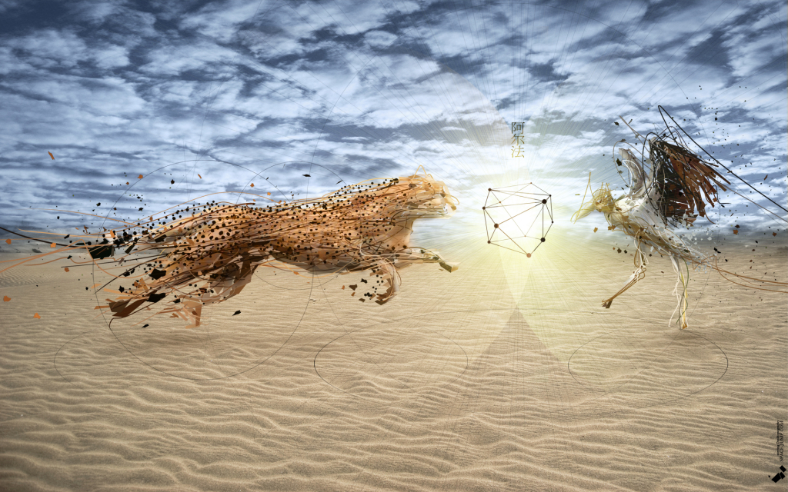
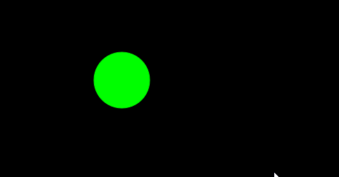
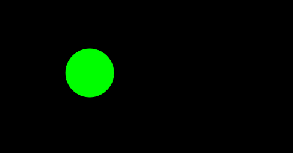
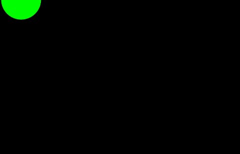
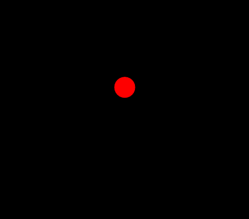
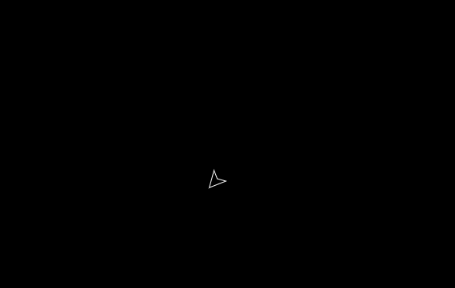

##《每周一点canvas动画》——加速度



在上一节中我们介绍了速度的基本概念，包括`沿坐标轴的速度`，和更普适的`任意方向的速度`，在文章的最后我们做了一个`鼠标跟随`的示例，以及通过改变物体的`rotation`属性做了一个关于速度的扩展。通过上一节的学习你会发现在速度的作用下物体可以沿着任意方向运动了。但这还远远不够，因为我们的物体都是在做`匀速运动`。既然有`匀速运动`，当然就有`变速运动`喽！这一节我们介绍本章的另一个重要内容`加速度`。


## 1.加速度基本概念
以防有的同学把物理知识都还给老师了！在这我先废话的介绍下加速度是什么，好吧！就一句话，加速度是**描述物体速度变化快慢的物理量**。我们知道速度是表征物体运动快慢的物理量，这里加速度是来表征速度的变化的。用物理上的`时间/速度`图来表示就是这个样子：


从图中我们可以看到，匀速运动的速度是一直保持不变的，而变速运动的速速是随着时间变化的。如图所示，这里展示了一个匀加速运动，在Δt的时间内，速度增加了Δv，那么`加速度`用公式就可以表示为 `a= Δv / Δt`。ok！恶心的物理公式就此打住吧！下面我们来看看在代码中是如何实现的吧。

## 2.沿坐标轴的加速度
我们首先定义速度和加速度，然后，在动画循环中让速度每一帧都加上加速度，这样每一帧速度的值都在增加，球的位置相对来说每一帧就会增加的越来越多，反映到动画中就是运动的越来越块。

```bash
<canvas id="canvas" width="500" height="500" style="background:#000;">
       your browser not support canvas
   </canvas>
   <script src="../js/ball.js"></script> //引入工具函数文件
   <script src="../js/utils.js"></script> //引入球类
   <script>
       window.onload = function(){
           var canvas = document.****getElementById("canvas");
           var context = canvas.getContext("2d");
           
           var ball = new Ball(20);
           ball.x = canvas.width/6;
           ball.y = canvas.height/6;
           
           var vx = 0, ax = 0.1; //定义初始速度vx, 定义加速度a
           (function drawFrame(){
               window.requestAnimationFrame(drawFrame, canvas);
               context.clearRect(0,0,canvas.width,canvas.height);
               
               vx += ax; //速度每一帧都加上加速度的值
               ball.x += vx;
               ball.draw(context);
           }());
       }
    </script>
```
为了效果更加突出，这里放上了匀速运动的图片，与加速运动的图片做了一个对比。在示例代码中小球的运动方向沿着X轴，当然你也可以沿着Y轴，或者两者同时。当你在X轴和Y轴同时定义了加速度，你会发现和任意方向的速度一样，小球会沿着两者合速度的方向移动，这就引出了我们的下一部分--任意方向的加速度。

**匀速运动**



**加速运动**




## 3.任意方向的加速度
有了前一节关于任意方向速度的铺垫，这里就变得很简单了，加速度同样可以像速度那样合成分解。这里我们假设要让小球沿着30度的方向做加速度为0.05的加速运动，具体代码如下：

```bash
window.onload = function(){
           var canvas = document.getElementById("canvas");
           var context = canvas.getContext("2d");
           
           var ball = new Ball(20);
           ball.x = 0;
           ball.y = 0;
           
           var vx = 0, vy = 0, //初始速度为0
               ax = 0, ay = 0, //分加速度为0
               angle = 30, //运动方向
               aTotal = 0.05; // 定义加速度的大小
           
           (function drawFrame(){
               window.requestAnimationFrame(drawFrame, canvas);
               context.clearRect(0,0,canvas.width,canvas.height);
               
               //加速度分解
               ax = Math.cos(30 * Math.PI/180)*aTotal;
               ay = Math.sin(30 * Math.PI/180)*aTotal;
               
               vx += ax;
               vy += ay;
         
               ball.x += vx;
               ball.y += vy;
               ball.draw(context);
           }());
       }
```
具体效果如下图所示：



与任意方向速度的概念一样，我们设定加速度的大小，以及物体运动的方向。然后再动画循环中，将加速度分解到水平和垂直两个方向，然后让水平速度和垂直速度在每一帧都加上相对应的加速度值，我们就可以得到一个沿任意方向加速(减速)运行的小球。


## 4.重力加速度
在这一部分我们介绍加速度中比较特别的一个 —— 重力加速度。重力加速度其实是由两个物体间的引力形成的，到后面我们专门会有一个章节来介绍万有引力，并且将它运用于我们的动画之中。

对于这个特殊的加速度，我相信你对它应该不会感到陌生，因为在中学的课本中`G`这个符号不知道出现了多少次。我们需要知道的是，在地球上，任何一个物体从空中下落到地面，它都有一个竖直向下的加速度。

ok！代码时间，我们的题目是：`小球从空中自由降落至地面，然后弹起，循环往复，直到它最终速度为零停留在地面`。好吧！这次我们先看模拟出来的效果：



具体代码如下：

```bash
window.onload = function(){
           var canvas = document.getElementById('canvas');
           var context = canvas.getContext('2d');
           
           var ball = new Ball(20, "red");
               ball.x = canvas.width/2
               ball.y = canvas.height/2 - 200;
               
           var vy = 0,  //初始速度
                gravity = 0.2, //定义重力加速度
                bounce = -0.8; //定义反弹系数
                
           //碰撞检测
           function checkGround(ball){
               if(ball.y + ball.radius > canvas.height){
                   ball.y = canvas.height - ball.radius;
                   vy *= bounce; //速度反向并且减小
               }
           }

           (function drawFramw(){
              window.requestAnimationFrame(drawFramw, canvas);
              context.clearRect(0, 0, canvas.width, canvas.height);
              
              vy += gravity;
              ball.y += vy;
              
              //碰撞检测
              checkGround(ball);
              ball.draw(context);
           }());
   }
```

在这段代码中，除了本章介绍的内容，还包括部分下一章会介绍的内容，但是以你们的聪明才智我相信这完全是小菜一碟，对吧！我们在初始化阶段定义了在Y轴方向的初始速度`vy`, 还有重力加速度`gravity`, 以及一个反弹系数`bounce`。这里面我们做了一个简单的碰撞检测，当小球下落到地面(也就是canvas画布的底部)，它的位置为 `canvas.height - ball.radius`，并且此时速度反弹，方向向上。然后再循环动画中调用碰撞检测函数，这样就出现了落地反弹的效果，至于为什么会最后停留在地面上，那是因为`bounce`是个小数，每碰撞一次`vy` 都会减小。好了，这只是一个简单的动画，我就不费嘴皮子了。

## 5.太空船
在这个实例中我们要达到的效果是：**通过键盘上的方向键控制太空船朝着不同的方向运动**。在这里我们需要新建一个`spaceShip.js`类文件，ship.js文件的代码如下, 当然，你也可以去代码库中寻找。

```bash

    function SpaceShip(){
      this.x = 0;
      this.y = 0;
      this.width = 25;
      this.height = 25;
      this.rotation = 0;
      this.showFlame = false;
    }

    SpaceShip.prototype.draw = function(context){
        context.save();
        context.beginPath();
        context.translate(this.x, this.y);
        context.rotate(this.rotation);
        context.strokeStyle = "#ffffff";
        context.moveTo(10, 0);
        context.lineTo(-10, 10);
        context.lineTo(-5, 0);
        context.lineTo(-10, -10);
        context.lineTo(10, 0);
        context.closePath();
        context.stroke();
        if(this.showFlame == true){
            context.save()
            context.beginPath();
            context.strokeStyle = "#f69";
            context.moveTo(-7.5, -5);
            context.lineTo(-15, 0);
            context.lineTo(-7.5, 5);
            context.stroke();
            context.restore();
        }
        context.restore();
    }
```

效果图如下：



具体代码如下

```bash
 <canvas id="canvas" width="1000" height="500" style="background:#000;">
       your browser not support canvas
   </canvas>
   <script src="../js/utils.js"></script>
   <script src="../js/spaceship.js"></script>
    <script>
      window.onload = function(){
          var canvas = document.getElementById('canvas'),
              context = canvas.getContext('2d');

          var spaceShip = new SpaceShip();
              spaceShip.x = canvas.width/2;
              spaceShip.y = canvas.height/2;
          
         //初始化
          var vr = 0,
              vx = 0,
              vy = 0,
              ax = 0,
              ay = 0,
              angle = 0,
              thrust = 0;
              
          //通过方向键控制各变量的值
          window.addEventListener('keydown',function(event){
              switch (event.keyCode){
                  case 37:    //left
                      vr = -3;
                      vx = 0;
                      vy = 0;
                      break;
                  case 39:  //right
                      vr = 3;
                      vx = 0;
                      vy = 0;
                      break;
                  case 38: //up
                      spaceShip.showFlame = true;
                      thrust = 0.05;
                      break;
                  case 40:
                      ax = 0;
                      ay = 0;
                      vx = 0;
                      vy = 0;
                      break;
              }
          }, false);

          window.addEventListener('keyup', function(event){
               vr = 0;
               thrust = 0;
               spaceShip.showFlame = false;
          }, false);

          (function drawFrame(){
              window.requestAnimationFrame(drawFrame, canvas);
              context.clearRect(0, 0, canvas.width, canvas.height);
              
              //角度
              spaceShip.rotation += vr *Math.PI/180;
              
              angle = spaceShip.rotation;
              ax = Math.cos(angle)*thrust;
              ay = Math.sin(angle)*thrust;
              
              vx += ax;
              vy += ay;
          
              spaceShip.x += vx;
              spaceShip.y += vy;
              
              spaceShip.draw(context);

          }());
      }
```
好了，看看是不是挺炫的，现在只要通过键盘上的方向键你就能控制我们的飞船超任意方向移动了。把代码放到你的编辑器中亲手体验一把吧。虽然我们的太空船只是一个简单的多边形，但是它能喷火啊！哈哈！

到这里速度与加速度一章就告一段落了，我们讲解了基本的速度与加速度概念，并且结合前面的三角函数实现了很多不同的效果。简单的示例，是否能够勾起你无限的创造力呢？敬请期待下一章——边界与摩擦力

