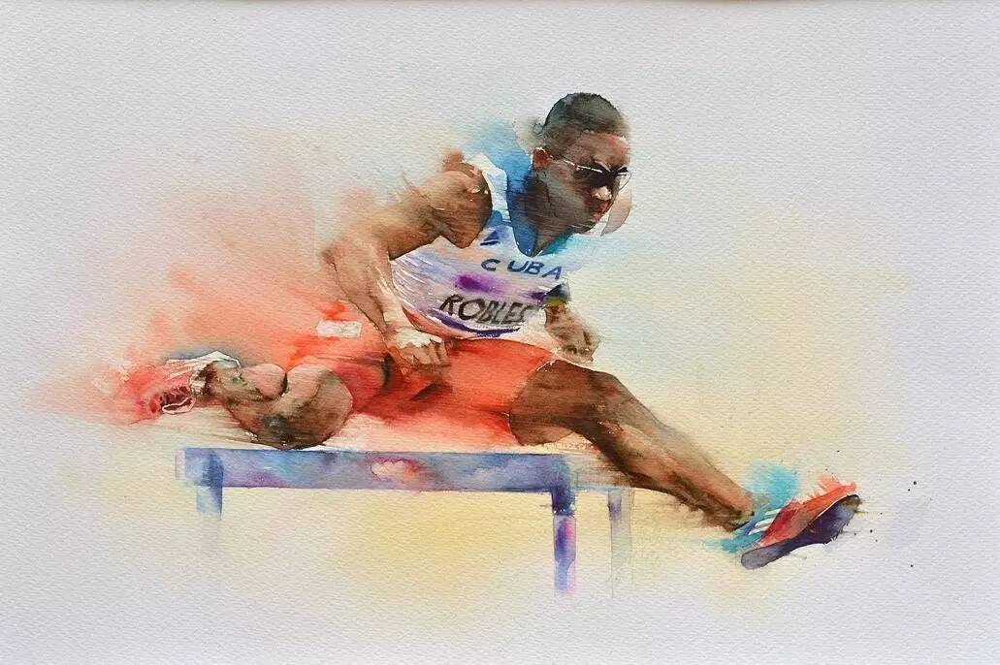
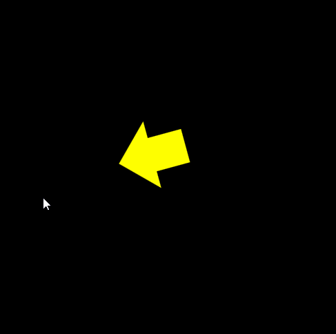

##《每周一点canvas动画》——速度



上一节中我们介绍了三角函数的应用，通过三角函数我们让小球实现了`平滑运动`，`线性运动`，`圆周运动`，`脉冲运动`等运动形式。这一节，我们介绍表征物体运动状态的另一个物理量——`速度`。

##1.速度与速率
**速度表征物体运动的快慢**。在讲解速度与速率的概念之前，我们需要了解两个数学上的概念：`矢量与标量`

**标量**：有大小而没有方向的物理量（速率，体积，温度）
**矢量**：有大小也有方向的物理量（速度，动量，力）

尽管我们平时很少区分速度和速率到底有怎样的区别。但在我们的程序中基本上用到的都是`速度`的概念。所以，你只需要记住我们用的这个变量既有数值大小也有方向就行了。


在上图中我们定义了两个速度v1和v2，它们具有相同的大小，但是方向却不相同，所以他们是完全不同的两个速度。

##2.坐标轴方向的运动
简单的介绍完速度的概念，那么怎样把它运用在我们的动画中呢？比如，现在我要让小球沿着X轴的方向以速度为1做匀速运动，直观的感受是小球的位置不停的在发生变化，也就是说，速度其实作用在了小球的x坐标上。具体代码如下：

```
    <canvas id="canvas" width="500" height="500" style="background:#000;">
        your browser not support canvas
    </canvas>
    <script src="../js/ball.js"></script>
    <script src="../js/utils.js"></script>
    <script>
        window.onload = function(){
            var canvas = document.getElementById('canvas');
            var context = canvas.getContext('2d');
            
            var ball = new Ball();
                ball.x = canvas.width/4;
                ball.y = canvas.height/4;

            var vx = 1; //定义速度
            
            //动画循环
            (function drawFrame(){
                window.requestAnimationFrame(drawFrame, canvas);
                context.clearRect(0, 0, canvas.width, canvas.height);
                
                ball.x += vx; // 在每一帧中都让小球的位置加上速度
                
                ball.draw(context);
            }());
        }
    </script>
```
在上面的代码中，我们定义了一个速度vx，并在动画循环中让球的x轴坐标每一帧都加上一个初始的速度值！这样小球就会沿着x轴正方向做匀速运动！仔细观察你会发现，这其实就是你以前学习过的物理公式`s=vt`。至于 t 在哪？你可以想想。


同理，如果你想要让小球沿着Y轴正方向做匀速运动，只需要简单的定义一个水平方向的速度vy,然后，让小球的纵坐标值每帧都加上vy,就OK了。

```
var vy = 1; //定义速度
ball.y += vy // 在每一帧中都让小球的位置加上速度

```


那么，如果同时在X轴和Y轴方向上定义了速度，并且分别作用于小球的X坐标和Y坐标，会是什么效果呢？

```bash
var vx = 1;
var vy = 1;
...
ball.x += vx;
ball.y += vy；
```


我们可以看到小球既不沿着x轴也不沿着y轴运动，而是沿着一个45度角的方向在做运动。

##3.任意方向的速度
通过上面的代码演示，我们知道，当同时在一个物体的x轴和y轴上定义速度，那么物体的运动方向是这两个速度方向的`和方向`，即满足矢量的叠加，大小满足勾股定理。


图1和图2,分别在X轴和Y轴上定义了速度Vx和Vy,它们的合速度满足平行四边形规则，即图中的`V合`，我们可以看到合速度的大小满足勾股定理，而它的方向因为在坐标轴上的分量不相同，所以方向也不相同。至于第三幅图，其实跟前两幅图没什么区别，只是它的两个速度方向并不是沿着坐标轴。这与物理中力的合成与分解是一样的，在这我就不废话了。

既然，我们知道了可以通过控制沿坐标轴方向的速度来改变物体的运动方向和运行的快慢。想想在三角函数应用那一块，如果我们想要让小球做一个圆周运动，采用这种方法可行吗？

答案是绝对可以实现的！但是在圆周运动中，物体的运动方向时刻都在发生变化，如果你想要得到一个完美的圆周运动，就需要时刻改变X轴和Y轴的坐标值。我的天,这是多么大的工作量！所以，在那一章中们将`圆的直角坐标表达式`转化为`圆的参数方程`，为的就是找到更易于控制的元素。

那么现在，如果想要让小球按照我们指定的方向运动，该怎么办呢？答案当然是三角函数啦。。。，试想现在导演说：小球，你以每秒5米的速度，30度角方向运动。那么从中我们得到的信息量是，小球的合速度是5，方向是30度。那么把它分解到坐标轴上就是`vy = 2.5`,`vx = 4.33`。


具体到代码如下

```bash
...
var speed = 5;
var angle = 30;
(function drawFrame(){
               window.requestAnimationFrame(drawFrame, canvas);
               context.clearRect(0, 0, canvas.width, canvas.height);
               
               //将速度分解到X轴和Y轴，注意这里用的是弧度制，要乘上Math.PI/180
               var vx = Math.cos(angles*Math.PI/180)*speed;
               var vy = Math.sin(angles*Math.PI/180)*speed;
               
               //坐标位置每一帧都加上速度
               ball.x += vx;
               ball.y += vy;
               ball.draw(context);
           }())
```

在代码中我们直接定义了物体的运行速度，和运行的方向。然后在动画循环中通过三角函数动态的去计算每一帧在x轴和Y轴上应该移动的距离。

##3.鼠标跟随
了解了上面的知识，现在我们来模拟一个很炫酷的动画。我叫它`鼠标跟随`，它实现的效果就是让物体跟着鼠标移动，每当你改变鼠标的位置，物体就会改变它的运动方向，并朝着鼠标的方向移动作匀速移动。还记得我们在三角函数那一章结尾的运用实例吗？在那个实例中我们做了一个跟随鼠标旋转的箭头，今天我们做的这个鼠标跟随的效果就是在此基础上，运用本章所学内容的一个改进。



具体代码如下：

```
<canvas id="canvas" style="background:#000;" width="500" height="500">
       you browser not support canvas
   </canvas>
   <script src="../js/arrow.js"></script>
   <script src="../js/utils.js"></script>
   <script>
       window.onload = function(){
           var canvas = document.getElementById("canvas");
           var context = canvas.getContext("2d");
           //获取鼠标相对canvas的位置
           var mouse = utils.captureMouse(canvas);
           
           var arrow = new Arrow();
           arrow.x = canvas.width/2;
           arrow.y = canvas.height/2;
           
           var angle = 0, speed = 2; //定义速度和方向
           
           (function drawFrame(){
               window.requestAnimationFrame(drawFrame, canvas);
               context.clearRect(0,0,canvas.width,canvas.height);
               
               //这点看不懂的话，就去复习一下吧，我们要用它来计算角度
               var dx = mouse.x - arrow.x; 
               var dy = mouse.y - arrow.y; 
               
               //得到角度值
               angle = Math.atan2(dy, dx);
               
               //箭头旋转
               arrow.rotation = angle;//angle默认为弧度
               
               //将速度分解
               var vx = Math.cos(angle)*speed;
               var vy = Math.sin(angle)*speed;
               
               //移动
               arrow.x += vx;
               arrow.y += vy;
               //绘制
               arrow.draw(context);
           }());
       }
    </script>
```
这里我们首先初始化好速度和角度，然后将鼠标的坐标值减去箭头的坐标位置，得到dx,dy, 然后运用Math.atan2()得到角度值(通过此方法得到的是弧度制的角度)，最后运用三角函数将速度分解到x和y方向。

##4.扩展
前面我们介绍了怎样通过三角函数来实现任意方向的速度。那么还有其他的方法改变物体的运动方向吗，在这部分中我们介绍一个扩展方法，他运用的是canvas的rotation()方法，具体代码如下：

```
window.onload = function() {
           var canvas = document.getElementById("canvas");
           var context = canvas.getContext("2d");
           
           var arrow = new Arrow();
           arrow.x = canvas.width/2;
           arrow.y = canvas.height/2;
           
           var vr = 30, speed = 2;
           
           (function drawFrame(){
               window.requestAnimationFrame(drawFrame, canvas);
               context.clearRect(0,0,canvas.width,canvas.height);
               
               //通过rotation来改变角度值
               arrow.rotation = vr*Math.PI/180;
               //分解
               arrow.x += Math.cos(arrow.rotation)*speed;
               arrow.y += Math.sin(arrow.rotation)*speed;
               
               arrow.draw(context);
           }())
       }

```
这里我们通过改变箭头的rotation属性来定义方向，然后其他的都是一样的将速度分解到x方向和y方向，坐标位置改变等。